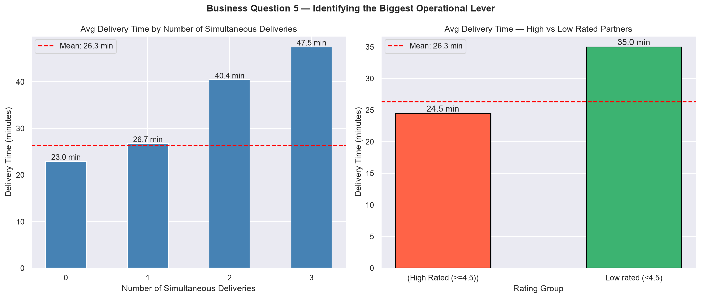
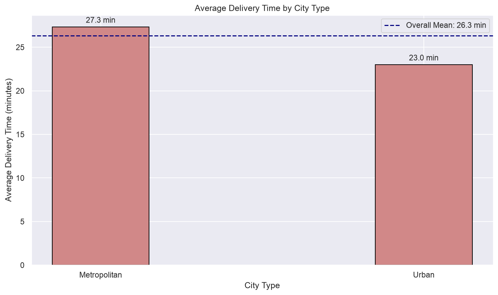

# Zomato Delivery Operations Analytics


## Project Overview
An end-to-end data analytics project analysing 44,127 Zomato food 
delivery transactions to identify the key operational factors driving 
delivery delays across Indian cities.

Built as part of a professional Data Analyst portfolio — using Python, 
Pandas, Matplotlib, Seaborn, and SQL.

---

## Problem Statement
Zomato's operations team wants to understand what factors most impact 
delivery time and customer satisfaction. As a Data Analyst, the goal 
is to identify the biggest operational gaps and provide a prioritized, 
data-driven action plan.

---

## Dataset
- **Source:** Kaggle — Zomato Delivery Operations Analytics by Saurabh Badole
- **Size:** 45,584 rows × 20 columns (raw) → 44,127 rows × 15 columns (cleaned)
- **Domain:** Food Delivery / Quick Commerce Operations

---

## Tools & Technologies
| Tool | Purpose |
|---|---|
| Python 3.11 | Core analysis language |
| Pandas | Data manipulation and cleaning |
| Matplotlib + Seaborn | Data visualization |
| SQLite3 | SQL-based business queries |
| Jupyter Notebook | Development environment |
| Git + GitHub | Version control and portfolio |

---

## Project Structure
```
Zomato-Delivery-Analytics/
├── data/
│   └── Zomato Dataset.csv
├── notebooks/
│   └── zomato_analysis.ipynb
├── sql/
│   └── zomato_queries.sql
├── visuals/
│   └── (12 charts — PNG format)
└── README.md
```

---

## Key Findings

### 1. Multiple Deliveries is the #1 Operational Problem
- Single deliveries average **23.0 minutes**
- Three simultaneous deliveries average **47.5 minutes**
- **106.8% increase** in delivery time from single to triple load
- 64% of all deliveries involve at least one simultaneous order

### 2. Traffic Jams Add 44.7% to Delivery Time
- Low traffic: **21.5 min** → Jam conditions: **31.1 min**
- Jam + Fog combination averages **42.44 minutes**
- Sunny + High traffic is the worst single combination: **46.19 minutes**

### 3. Metropolitan Cities Have Double the SLA Breach Rate
- Metropolitan SLA breach rate: **19.68%**
- Urban SLA breach rate: **10.27%**
- Metropolitan deliveries are **18.7% slower** on average

### 4. High Rated Partners Deliver 51.6% Faster
- High Rated (≥4.5): **24.46 minutes** — 82% of all deliveries
- Low Rated (<4.0): **37.08 minutes**
- Low ratings likely caused by operational overloading — not partner failure

### 5. Order Type Has No Meaningful Impact
- All four order types within **0.3 minutes** of each other
- Delays happen **post-pickup** — not in the kitchen

---






## Business Recommendations

### Recommendation 1 — Cap Simultaneous Deliveries at 1
Limiting riders to one simultaneous delivery during peak hours would 
bring the 2,244 overloaded deliveries from 40-47 minutes toward the 
23-minute benchmark — a potential 50%+ SLA improvement.

### Recommendation 2 — Traffic-Based Dispatch Management
Integrate real-time traffic data into dispatch. During Jam conditions, 
assign riders closest to restaurants and adjust customer ETAs upward 
automatically.

### Recommendation 3 — Fix the Rating System
Audit low-rated partners — separate operational overloading from 
genuine performance issues before penalizing or offboarding partners.

---

## The Single Biggest Lever
> Reduce simultaneous delivery assignments in Metropolitan areas.
> This one change addresses the #1 delay driver, reduces SLA breaches,
> and improves partner ratings — all from one operational policy change.

---

## Analysis Workflow
```
Phase 1 → Data Ingestion & Inspection
Phase 2 → Data Cleaning & Preprocessing
Phase 3 → Exploratory Data Analysis (EDA)
Phase 4 → Core Business Analysis
Phase 5 → Visualizations
Phase 6 → SQL Analysis
Phase 7 → Insights & Recommendations
```

---

## Author
**Miraj Rajendra Patil** 
MCA in Data Science — MIT ADT University
   [LinkedIn](https://linkedin.com/in/mirajpatil/) | [GitHub](https://github.com/CodeByMiraj)
